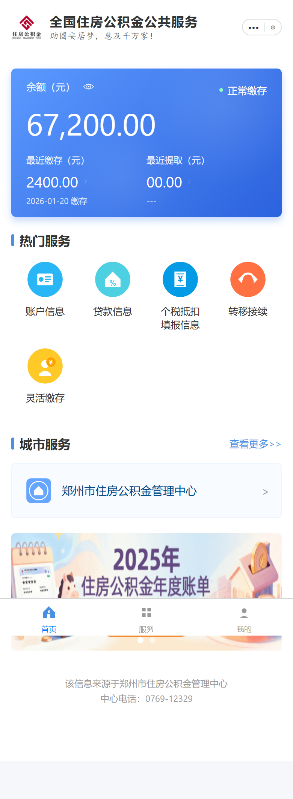
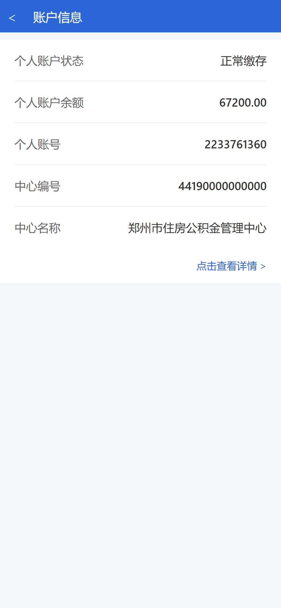
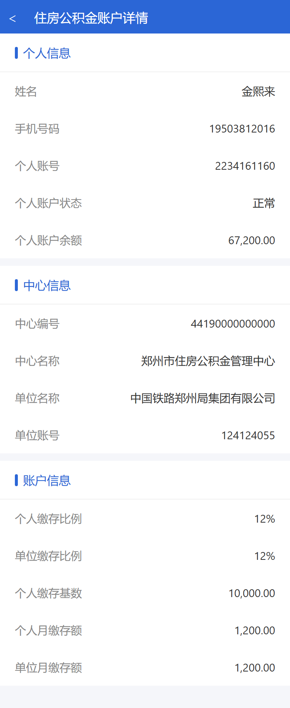
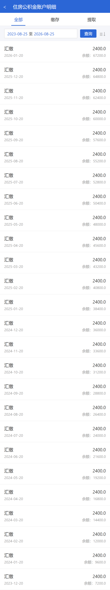

# 全国住房公积金 · UniApp 仿写演示（展示版）

> **移动端住房公积金业务 App UI / 交互演示**（Uni-app）  
> 本仓库为 **产品展示包**（完整页面截图 + 介绍），**不含完整源码**。  
> 需要源码、二开、多城市定制、打包上架？直接加 QQ 咨询。

---

## 联系咨询（源码 / 定制 / 打包）

| 方式 | 账号 |
|------|------|
| **QQ** | **3200202827** |

适合：政务/民生类 App 学习、UI 仿写交付、多端（H5 / 小程序 / App）打包演示、毕业设计与商业定制。

---

## 项目简介

基于 **Uni-app** 实现的「全国住房公积金」风格移动端界面，覆盖首页服务入口、个人账户、缴存明细与历史查询等常见业务页面。

技术栈：**Uni-app · Vue · 自定义导航栏 · TabBar**

---

## 功能亮点

| 模块 | 说明 |
|------|------|
| 首页服务 | 余额卡片、热门服务入口、城市服务、轮播 Banner |
| 我的账户 | 个人账户状态、余额、账号与中心信息 |
| 账户详情 | 个人/单位缴存额、缴存比例等明细 |
| 缴存历史 | 按月查询缴存记录 |

---

## 完整界面截图

### 首页

### 账户信息

### 账户详情

### 缴存历史

---

## 界面素材（Logo / Banner）

| | |
|---|---|
|  |  |
|  |  |

> 全部截图见 [`screenshots/`](screenshots/) 目录。

---

## 交付说明

本仓库 **仅展示能力与截图**，不包含：

- `.vue` 页面源码、业务逻辑  
- 可运行工程、密钥与后端接口  

完整工程（含 HBuilderX 工程、多端打包说明、可二开源码）请联系：

### QQ：3200202827

可提供：源码交付、换城市换皮、对接真实公积金接口、App 云打包协助、界面增改。

---

## License

本仓库仅含介绍与展示素材，不含商业源码。展示内容仅供了解产品形态；完整源码与商业授权请联系 QQ **3200202827**。
